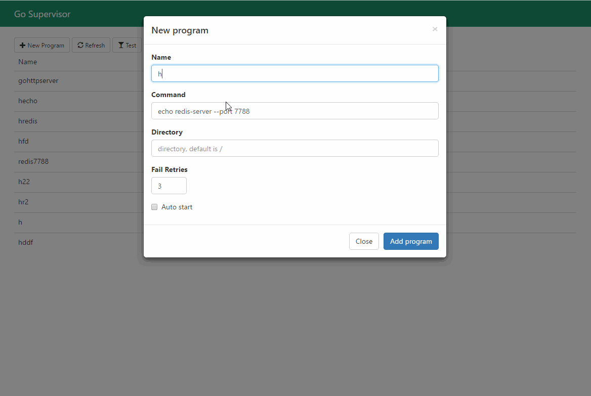

# gosuv
[](https://travis-ci.org/codeskyblue/gosuv)

## Should not use in production now (current is in beta)
Process management writtern by golang, inspired by python-supervisor

## So why write another supervisor?
I have been using python-supervisor for many years and there are something uncomfortable feelings.

1. Log can't contains ANSI color chars
1. The configuration file can add on the web, often forgot some settings.
1. `supervisorctl reload` will cause supervisord restarted
1. Hard to set status change to fatal notifications.
1. No process performance monitor page.
1. Program starts with no common environ, eg, missing HOME and USER variable
1. Kill process default is not group kill which make sub process still running.
1. More... will added when I think of it.

## Features

* [x] Web control page
	
  * [x] Start, Stop, Tail, Reload
  * [x] Realtime log
	* [x] Add program support
	* [ ] Edit support
	* [ ] Delete support
	* [ ] Path auto complete <https://github.com/twitter/typeahead.js>
	* [x] Memory and CPU monitor

* [x] HTTP Basic auth
* [x] Github webhook
* [ ] Single log page, include search support
* [ ] 中文文档

## Requirements
Go version at least `1.6+`

## Installation
Standalone binary can be download from one of the following addresses

| Branch | Source | Address |
|--------|--------|---------|
| stable | equinox| <https://dl.equinox.io/shengxiang/gosuv/stable> |
| stable | github | <https://github.com/codeskyblue/gosuv/releases/latest>|
| dev    | equinox| <https://dl.equinox.io/shengxiang/gosuv/dev> |

Or if you have go enviroment, you can also build from source.

```sh
go get -d github.com/codeskyblue/gosuv
cd $GOPATH/src/github.com/codeskyblue/gosuv
go build
```

If you want to build a standalone binary, run the following command.

```sh
go get github.com/elazarl/go-bindata-assetfs/...
go-bindata-assetfs -tags bindata res/...
go build -tags bindata
```

## Quick start
After you installed gosuv, the first thing is to start server.

```sh
gosuv start-server
```

Show server status

```sh
$ gosuv status
Server is running
```

Open web <http://localhost:11313> to see the manager page. And follow the gif to add a program to gosuv.




## Configuration
Default config file stored in directory `$HOME/.gosuv/`, Set env-var `GOSUV_HOME_DIR` can change config file store directory.

- file `programs.yml` contains all program settings.
- file `config.yml` contains server config

File `config.yml` can be generated by `gosuv conftest`

Example config.yaml

```
server:
  httpauth:
    enabled: false
    username: uu
    password: pp
  addr: :11313
client:
  server_url: http://localhost:11313
```

Logs can be found in `$HOME/.gosuv/log/`

Edit config file(default located in `$HOME/.gosuv/programs.yml`) and run `gosuv reload` will take effect immediately.

## Design
HTTP is follow the RESTFul guide.

Get or Update program

`<GET|PUT> /api/programs/:name`

Add new program

`POST /api/programs`

Del program

`DELETE /api/programs/:name`

## State
Only 4 states. [ref](http://supervisord.org/subprocess.html#process-states)


## Notification
Configuration example

```yaml
- demo-program:
  command: ...
  notifications:
    pushover:
      api_key: [token]
      users:
      - [user1]
      - [user2]
```

Now only support [pushover](https://pushover.net/api), and only status change to fatal will get notified.

## Integrate with github (todo)
This is feature that will helps update your deployment environment once your updated in the github.

This part is set in the `programs.yml`, take look the example

```yml
- demo-program:
  command: python app.py
  directory: /opt/demo
  webhook:
    github:
      secret: 123456
      command: git pull origin master
```

## LICENSE
[MIT](LICENSE)
